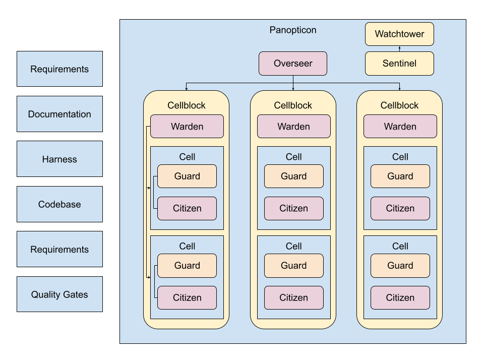

# panopticon

Opinionated agentic engineering with a harness-based approach.

## Overview

The panopticon is an approach to agentic delivery that aims to address some of the more common questions we have as engineering professionals; questions like 'Can I trust the output?', 'What did my agent do?' and 'What is my agent team actually even doing right now?'.

This approach comes with some assumptions - the main one being that the principles of harness engineering outline by OpenAI [here](https://openai.com/index/harness-engineering/) are being adopted.

What that effectively means is:
- that *everything* is in the repository - specs, decision logs, expectations
- that everything is validatable, observable and self-correction is possible
- that the repository is build to be agent legible from the ground up

What panopticon adds - the harness based engineering process still relies entirely on agents to follow instructions and not go off task. What this means is that we end up having to add stringent safety guards in our CI processes that produce helpful remediation hints for our agents to then consume.  What this means though is that the cycle time becomes much longer - building the PR takes time, running the CI can be costly in time and money both.  Panopticon brings this to your engineers machines in the form of the guard.

The guard runs an explicit set of steps locally before any work is allowed to be pushed as a PR candidate.  It's not quite a CI workflow, more like a pre-flight checklist.  You wouldn't want your pilot to take off without checking their plane was in order, so why let your agents raise PRs that fail the basics.

## The Nuts and Guts

Panopticon’s target operating model is a supervised “agent work loop” that turns repository-defined expectations into fast local feedback.

### Target workflow (conceptual)

This is the intended end-to-end flow:

1. **Overseer** starts and runs a loop.
2. Overseer is prompted to perform its tasklist (review updates, read plans, look for deliverable work).
3. Overseer finds work that can be completed without conflicting with active work.
4. Overseer creates a **cellblock** (a work package) and assigns it.
5. A cellblock-level **Warden** breaks the work down into parallelisable **cells**.
6. Each cell assigns a task to a **Citizen** (an agent runner) to implement the change.
7. When a Citizen finishes, **Guard** runs the repository’s checklist for that cell.
	- If Guard fails, the Citizen is re-prompted with the Guard output (remediation loop).
	- If Guard passes, the Warden accepts the result and closes the cell.
8. When all cells are closed, the Warden opens a PR for the cellblock.
9. Humans review/approve; the Warden closes the cellblock.

For MVP, “useful” includes step 8: automatic PR creation.

### Concepts

The core parts of Panopticon are:

- **Overseer**: the top-level scheduler/manager that discovers work, monitors active cellblocks, and coordinates progress.
- **Cellblock**: a unit of work large enough to become a PR (may contain multiple cells).
- **Warden**: the cellblock-level manager that decomposes work, tracks cells, and decides when to open a PR.
- **Cell**: a parallelisable task within a cellblock.
- **Citizen**: the worker agent that performs a single cell task.
- **Guard**: the *gate* between “Citizen says it’s done” and “Warden accepts it”. It runs a repo-defined checklist (tests, invariants, docs checks, build, or anything else you require) and produces structured, remediation-oriented output.

Guard is not only “before pushing” or “before raising a PR” — it runs after each cell’s work so failures are caught early and fed back into the same cell loop.

### What exists in this repo today

This repository currently implements the local harness and observability pieces (Sentinel/Watchtower/Overseer/CLI) plus deterministic repo checks (`npm run check`, `npm run invariants`, `npm run smoke`).

The multi-agent orchestration roles (Warden/Citizen/Guard-as-a-loop-with-reprompting/auto-PR) are the intended direction described above, but are not yet fully implemented as first-class runtime components.

Each of these has access to the documentation of the project. OVERSEER and CITIZEN could be handled as SKILLS if supported by the 'ai agent' in question.

## Architecture



This repo is a small monorepo:

- **sentinel**: in-memory API server used by the UI (SSE at `GET /api/events`, plus logs/questions/cell endpoints).
- **watchtower**: lightweight realtime UI (React) for dashboards.
- **overseer**: a local process that emits structured logs (to file + console + Sentinel).
- **panopticon-cli**: the CLI that runs diagnostics and starts/stops the local stack.
- **panopticon**: a thin published wrapper that exposes the `panopticon` binary (it just loads `panopticon-cli`).

## Repository guidance

- Agent/contributor map: [AGENTS.md](AGENTS.md)
- Documentation index: [docs/index.md](docs/index.md)
- Architecture notes: [docs/architecture.md](docs/architecture.md)
- Quality expectations: [docs/quality.md](docs/quality.md)
- Active plan: [docs/plans/active/panopticon-mvp-roadmap.md](docs/plans/active/panopticon-mvp-roadmap.md)
- Completed adoption plan: [docs/plans/complete/harness-engineering-adoption.md](docs/plans/complete/harness-engineering-adoption.md)

## Requirements

- Node.js **>= 22**
- npm (uses npm workspaces)

## Quickstart (UI + API)

From the repo root:

```bash
npm install
npm run dev
```

- Sentinel (API): `http://localhost:8787`
- Watchtower (UI): `http://localhost:5173` (proxies `/api` to Sentinel)

If `runtime.portStrategy: worktree` is enabled, those ports are derived from the checkout path instead of staying fixed. The actual URLs are printed when the stack starts.

### Demo mode

Publishes fake overseer/cell activity into Sentinel:

```bash
npm run dev:demo
```

## CLI

The CLI command is named `panopticon`.

From the repo root (uses the workspace binary):

```bash
npx panopticon doctor
```

Start the full local stack (Sentinel + Watchtower + Overseer):

```bash
npx panopticon start --dev
```

Notes:

- `--dev` runs each package's `dev` script (hot reload / watch). Without `--dev`, the CLI expects built `dist/` outputs.
- `PANOPTICON_DEV=1` is equivalent to `--dev`.
- Windows is not supported directly; use WSL2, a Linux VM, or a Linux dev container.

## Build and test

Build everything:

```bash
npm run build
```

Run tests:

```bash
npm test
```

Run the default validation contract for a change:

```bash
npm run check
```

Run the structural invariant checks directly:

```bash
npm run invariants
```

Run the built harness smoke test directly:

```bash
npm run smoke
```

`npm run smoke` builds the workspaces, starts the supervised local stack on isolated ports, verifies health through Watchtower's `/api` proxy, performs a representative API write, observes the result through SSE, and confirms clean shutdown.

## Worktree-local ports

The checked-in `panopticon.yaml` uses `runtime.portStrategy: worktree` by default.

- Each checkout gets a deterministic Sentinel and Watchtower port pair derived from its path.
- `overseer.sentinelUrl` and `watchtower.apiBaseUrl` follow the resolved Sentinel port automatically unless you override them.
- If you need fixed ports for one checkout, set explicit port values or switch `runtime.portStrategy` to `fixed`.

## Platform support

This repository supports **Linux/macOS/WSL2** environments for running the local supervisor and managed processes.

If you're on Windows, use one of:

- **WSL2** (recommended)
- **Dev Container** (VS Code)
- A Linux VM
